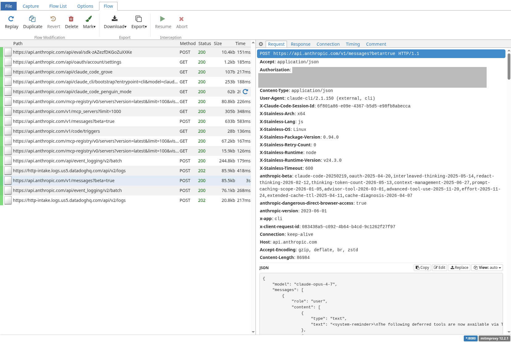

# claude-capture

A drop-in wrapper around the `claude` CLI that records every HTTP(S) request it makes to a [HAR](https://en.wikipedia.org/wiki/HAR_(file_format)) file. Useful for debugging, auditing model traffic, replaying conversations, or inspecting tool-use payloads.

## Install

```bash
curl -fsSL https://raw.githubusercontent.com/bcap/claude-capture/main/install.sh | bash
```

Clones the latest release tag into `~/.local/share/claude-capture` and symlinks `claude-capture` into `~/.local/bin`. Re-run to update. To uninstall:

```bash
curl -fsSL https://raw.githubusercontent.com/bcap/claude-capture/main/install.sh | bash -s -- --uninstall
```

Pin to a specific ref (tag or branch) with `CLAUDE_CAPTURE_REF`:

```bash
CLAUDE_CAPTURE_REF=main   curl -fsSL .../install.sh | bash   # bleeding edge
CLAUDE_CAPTURE_REF=v0.1   curl -fsSL .../install.sh | bash   # specific release
```

Other env-var overrides: `CLAUDE_CAPTURE_HOME`, `BIN_DIR`.

You still need `mitmproxy` on `PATH` — see [Requirements](#requirements).

## Usage

Just run `claude-capture` instead of `claude`. Any args passed are forwarded to `claude`

Eg:
```bash
./claude-capture                      # claude's regular interactive session
./claude-capture -p "summarize foo"   # any args are forwarded to claude
./claude-capture --help               # claude's own --help
```

Output (in the current working directory):

```bash
.claude-traffic-YYYYMMDD-HHMMSS.har.zst   # or .xz / .gz / .har
```

The wrapper preserves claude's exit code, so you can use it anywhere you'd use `claude` — including in scripts and pipelines.

### Inspecting traffic live (during the run)

On startup the wrapper prints a `[mitm]` line to stderr, before claude's TUI takes over

```
[mitm] msg="proxy started" proxy=127.0.0.1:36223 pid=1996456 webui=http://127.0.0.1:59971/?token=192ca219a1710a5468b2fcdba3929f72 har_entries=.claude-traffic-20260525-015202.har-entries.jsonl
```

There are two ways to follow the capture in real time:

- **mitmweb browser UI** logged at the start (`http://127.0.0.1:<random>/?token=<random>`) — full per-flow inspection (headers, bodies, timing) in your browser as requests stream in. Bound to `127.0.0.1` only

  

- **Tail the NDJSON entries file** — `tail -n +1 -f .claude-traffic-*.har-entries.jsonl`. One HAR entry per line, fsynced as each flow completes. Good for `jq` pipelines or scrollback.

Both are live and read-only. You can use either or both, in any number of terminals/browsers.

### Inspecting the final HAR (after the run)

Once `claude` exits, the wrapper compresses the per-line NDJSON into a single `.har[.zst|.xz|.gz]` file in the current directory (it uses whichever compression tool is available). Two convenient viewers:

- **Chrome / Firefox DevTools** — Network panel → right-click → "Import HAR file". Needs an on-disk uncompressed file, so decompress first:
  ```sh
  zstd -d .claude-traffic-*.har.zst    # or: xz -d / gunzip
  ```
- **mitmweb** (inspection only, no proxy). Reads the compressed file directly from stdin, no uncompressed temp file needed. The browser UI will open automatically:
  ```sh
  zstd -dc .claude-traffic-20260524-181250.har.zst | mitmweb -n -r -
  # or: xz -dc / gunzip -c
  ```
  `-n` disables the proxy listener; `-r -` loads from stdin.

The HAR contains every request/response between `claude` and the outside world: headers, full request/response bodies (base64-encoded as per the HAR spec), and timing.

### Configuration

All env vars are prefixed `CAPTURE_*`:

| Env var | Default | What it does |
| --- | --- | --- |
| `CAPTURE_FILE_FORMAT` | `.claude-traffic-%Y%m%d-%H%M%S.har` | Full output filename, passed verbatim to `date +<format>`. Strftime tokens expand. Don't include the compression suffix — it's appended automatically. |
| `CAPTURE_COMPRESS` | `1` | Toggle final compression. Accepts `0/1`, `true/false`, `yes/no`, `on/off`. When disabled the raw `.har` is kept. |
| `CAPTURE_MITM_FLAGS` | _(empty)_ | Extra flags forwarded to the internal `mitmweb` (word-split, no shell-quote parsing). |

```sh
CAPTURE_MITM_FLAGS='-v --set stream_large_bodies=10m' ./claude-capture
CAPTURE_FILE_FORMAT='traffic-%s.har' CAPTURE_COMPRESS=0 ./claude-capture
```

## Requirements

- `mitmproxy` (`mitmweb` on `PATH`). You can install it in several different ways:
  - `brew install mitmproxy`
  - `uv tool install mitmproxy`
  - `pipx install mitmproxy`
  - `apt install mitmproxy`
  - `pacman -S mitmproxy`
  - more at https://mitmproxy.org

Optional (auto-detected, used if present): `zstd`, `xz`, `pigz`, `gzip`. If none are installed, the HAR is left uncompressed.

If `mitmweb` is missing, `claude-capture` prints a warning and runs `claude` normally without capture — it never blocks you from using `claude`.


## Manual NDJSON → HAR conversion

If a run is killed before the wrapper can post-process (e.g., the host loses power), you'll be left with a `.har-entries.jsonl` file. Convert it by hand:

```sh
./scripts/ndjson_to_har.py .claude-traffic-*.har-entries.jsonl out.har
./scripts/ndjson_to_har.py - - --pretty < entries.jsonl > out.har   # stdin/stdout
```

The converter tolerates a truncated final line, so partial captures still produce a valid HAR.

## Additional scripts

- `scripts/har_to_conversation.py` — reconstructs the user/assistant conversation from a captured HAR (handles `.har`, `.zst`, `.xz`, `.gz`). Merges shared message prefixes across `/v1/messages` POSTs so TUI rewinds show up as branches. Pass `--tokens` to annotate each assistant turn with in/out/cache token counts.
- `scripts/har_to_wire.py` — dumps a HAR as `curl -v`-style request/response pairs (reads stdin, writes stdout). Useful for eyeballing or grepping raw traffic.

## Files

- `claude-capture` — the wrapper you actually run
- `mitm/streaming_har_ndjson.py` — mitmproxy addon: writes one HAR entry per line, live
- `mitm/port_writer.py` — mitmproxy addon: publishes mitmweb's bound proxy port
- `scripts/ndjson_to_har.py` — assembles NDJSON entries into a HAR file
- `scripts/har_to_conversation.py` — reconstructs the user/assistant conversation (with branches) from a HAR
- `scripts/har_to_wire.py` — renders a HAR as curl -v style request/response pairs

## Notes and caveats

- The capture covers everything any process started inside `claude-capture` does over HTTP(S) — `claude` itself plus any child processes that inherit the proxy environment.
- Request/response bodies are stored verbatim, including auth headers. **Treat the HAR file as sensitive** — it contains your API key in the `Authorization` header on every request.
- HAR `cache: {}` is always empty by design; mitmproxy is a pass-through MITM, not a caching proxy.
- Tested on Linux; should work on macOS. Not tested on Windows.
